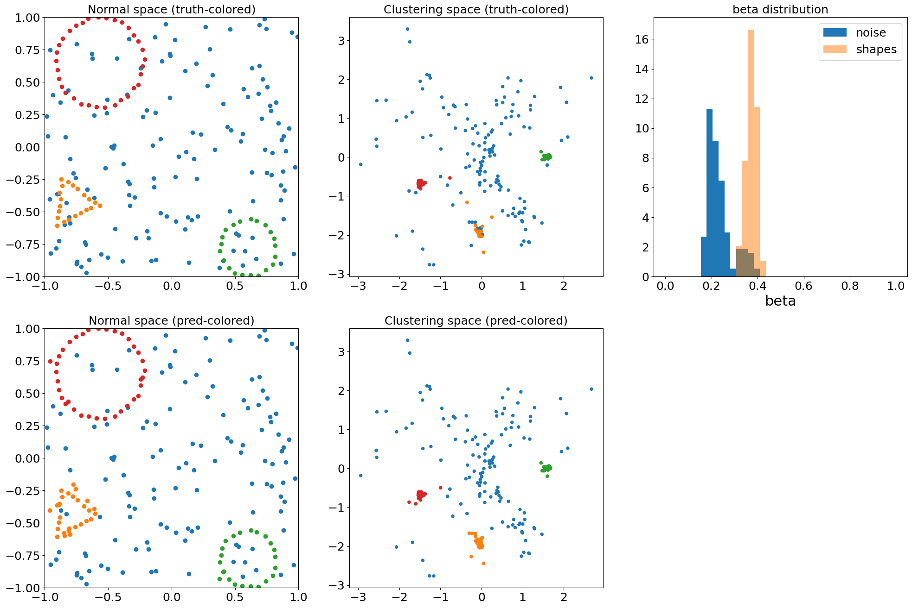

# Using a Graph Neural Network to detect shapes in point clouds

This repository contains code to solve the following problem:


Given a point cloud with a variable number of points (roughly 300 to 400), detect all the triangles, squares, and circles.
The number of shapes, their orientation, their respective number of points, and the total number of noise points will all vary per event.

## Setup

```bash
conda create -n myenv python=3.10
conda activate myenv
conda install pytorch::pytorch -c pytorch
conda install pyg -c pyg
conda install pytorch-cluster -c pyg
conda install pytorch-scatter -c pyg
pip install numpy
pip install matplotlib
pip install tqdm 
```

## Usage

To train the network, run:

```bash
python train.py train
```

To check the network's performance qualitatively, run:

```bash
python train.py plot models/gnn_best.pth.tar -c
```

It should produce an image that looks somewhat like this:


